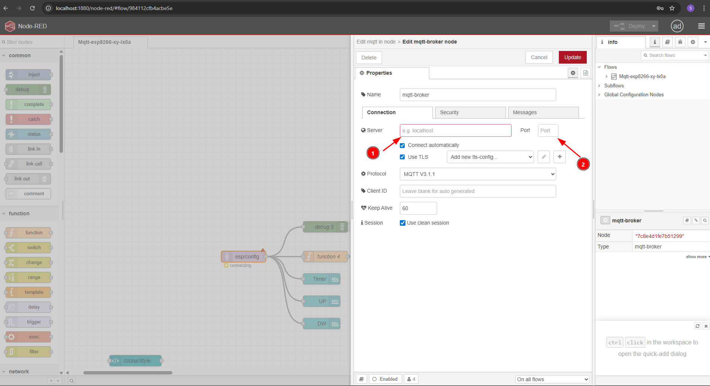

# Node-Red + MQTT + XY-LxxA module flow

[](LICENSE)

Youtube link (comming soon)

## Installation

Copy the code and paste it into the command prompt, then press `Enter`.

```bash
git clone https://github.com/BorisKotlyarov/Node-Red-and-XY-LxxA.git
```

Wait for Git to complete, and then navigate to the directory.
Navigate to `Node-Red-and-XY-LxxA`

```bash
cd Node-Red-and-XY-LxxA
```

Execute the following command in the terminal:

```bash
docker compose up -d
```

Wait for Docker Compose to finish.
All done – Node-Red is installed!

Let's verify that everything is working. To do this, open the admin panel in your browser.

Admin panel: [http://localhost:1880/node-red/](http://localhost:1880/node-red/)

Admin panel credentials:

```text
admin
password
```

Double click to node `esp/config`

Provide your MQTT host and Port

Provide your MQTT credentials and save config

Click Done

Deploy flow


Open your Dashboard (UI): [http://localhost:1880/node-red/ui](http://localhost:1880/node-red/ui)

Dashboard credentials:

```text
user
password
```

### Acknowledgements

This project uses [Node-RED](https://nodered.org/), which is copyright of the OpenJS Foundation and other contributors and is licensed under the Apache 2.0 license. More information about the foundation can be found at [https://openjsf.org/](https://openjsf.org/).

## License

This project is licensed under the [GNU General Public License v3.0](LICENSE).
